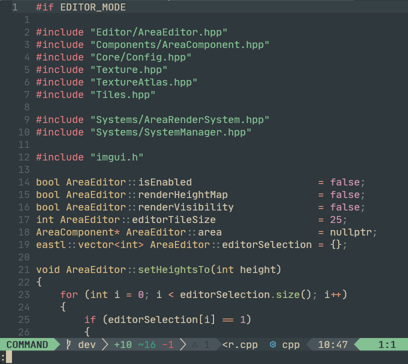

A Neovim plugin that makes switching between header & implementation files in `C/C++` quick and painless.

## Requirements

This should work with any version of Neovim that `plenary` currently supports.

## Installation

Using [vim-plug](https://github.com/junegunn/vim-plug)

```viml
Plug 'nvim-lua/plenary.nvim' " required dependency
Plug 'jakemason/ouroboros'
```

Using [packer.nvim](https://github.com/wbthomason/packer.nvim)

```lua
use {
  'jakemason/ouroboros',
  requires = { {'nvim-lua/plenary.nvim'} }
}
```

You can run `:checkhealth` to verify the plugin and dependencies are installed correctly.

Then you can set custom weights for file extension preference matching if you'd like:

```lua
-- these are the defaults, customize as desired
require('ouroboros').setup({
    extension_preferences_table = {
          -- Higher numbers are a heavier weight and thus preferred.
          -- In the following, .c would prefer to open .h before .hpp
          c = {h = 2, hpp = 1},
          h = {c = 2, cpp = 1},
          cpp = {hpp = 2, h = 1},
          hpp = {cpp = 1, c = 2},

          -- Ouroboros supports any combination of filetypes you like, simply
          -- add them as desired:
          -- myext = { myextsrc = 2, myextoldsrc = 1},
          -- tpp = {hpp = 2, h = 1},
          -- inl = {cpp = 3, hpp = 2, h = 1},
          -- cu = {cuh = 3, hpp = 2, h = 1},
          -- cuh = {cu = 1}
    },
    -- if this is true and the matching file is already open in a pane, we'll
    -- switch to that pane instead of opening it in the current buffer
    switch_to_open_pane_if_possible = false,
})
```

If you don't call setup explicitly, the defaults above will be used. Thus, according to the table above, a file ending in ".c"
will first look for a file ending in ".h" (weight of 2) before it looks for a match of ".hpp" (weight of 1).

You can get all of this information in the editor by running `:help ouroboros`.

## Usage

Invoke the command `:Ouroboros` as needed, or bind it as desired:

```viml
" Example binding -- only works in a c/cpp file
autocmd! Filetype c,cpp map<buffer> <C-e> :Ouroboros<CR>
```

If you'd like to open the result in a split, simply pipe `Ouroboros` to `vsplit` or `split`:

```viml

autocmd! Filetype c,cpp noremap<buffer> <leader>sv :vsplit \| Ouroboros<CR> " open result in a vertical split
autocmd! Filetype c,cpp noremap<buffer> <leader>sh :split \| Ouroboros<CR>  " open result in a horizontal split
```

If a matching file isn't found, you'll be prompted to create one in the same directory as the file you called
Ouroboros from. You can optionally edit the path and name, hitting enter to create the file and open it, or 
cancel and skip file creation entirely.

### Example:


*Manual typing of the command, followed by invoking it quickly via keystroke. This .gif is captured
at 7FPS, so it'll be a lot smoother on your machine.*

---

After the `Ouroboros` command is invoked, your working directory will be recursively searched until
a file matching the _same name_ with the _counterpart_ extension is discovered. Note that the
search also respects your `.gitignore` if one exists and any file ignored in `git` will be ignored
in the results. As such, I suggest working from the root of your project. Once that file is found,
it will automatically be opened in the current buffer. If no corresponding file is found, a message
will be logged to the messages buffer -- use `:messages` to review your recent messages.

## Assumptions

`Ouroboros` will only find a corresponding file if it has the same name and the counterpart
extension. If multiple files with the same name and counterpart extension are found, the first
result is opened. Conceivably in the future I'd like to present a window if more than one possible
match is found and allow the user to pick from the list.

## Debugging

Put `let g:ouroboros_debug = 1` into your `init.vim` file to enable additional logging that will
detail what Ouroboros is doing when running.

## Why use this plugin? There's several other options that do this!

None of the alternatives worked well for me. I'd been using
[coc-clangd](https://github.com/clangd/coc-clangd) most recently and wasn't pleased with the results
that calling `:CocCommand clangd.switchSourceHeader` would yield. Often the switch was noticeably
delayed (1.0s or more) or I could switch from a header file to the implementation,
but if I called `switchSourceHeader` again it would not switch back to the header, and vice versa.
This was increasingly common if the folder structure of the project was several layers deep.

I'd also tried [CurtineIncSw.vim](https://github.com/ericcurtin/CurtineIncSw.vim) and had similar
problems: failure to find corresponding files in larger projects, slow performance, etc. Same thing
with [a.vim](https://github.com/vim-scripts/a.vim), and `ctags` solutions as well.

This solution is fast, doesn't require code analysis, and is easy to use.
